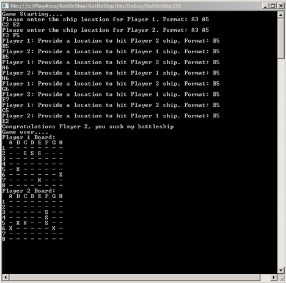

# Battleship

## Purpose
Create a simplified implementation of the classic game, Battleship, that best illustrates programming skills. This exercise should take no longer than 4 hours to complete.

## Requirements
- Two boards, one for each player.
- A board is an 8x8 grid for a total of 64 units.
- Each player has one ship that is 3 grid units in length.
- Each player will place their ship on the board either vertically or horizontally.
- The ships cannot be placed outside the grid bounds.
- Players take turns firing at their opponents ship.
- A hit is when a ship part is in a grid unit that a player fires at.
- A ship is sunk when all the parts have been hit.
- Grid units are specified by column and row.
- Columns are labeled A to H.
- Rows are labeled 1 to 8.
- The player grid should be displayed.

## What we're looking for
We want you to submit a solution you're proud of and we want you to be successful so here are some of the things we're looking for in a solution:

- Minimum UI expectation is a console application that will print player grids after each turn.
- We are looking for your understanding of best practices for designing quality code.
- Looking for good object oriented programming principles but doesn't go overboard.
- A solution that shows familiarity with language used.

## Bonus
- 10x10 grid.
- Each player has 2 ships. One ship of 2 grid units and the other ship of 3 grid units.
- The ships cannot occupy any of the same grid units.
- The rest of the rules apply and the game ends when one player sinks both of the other players ships.

## Example
- Ship is placed horizontally at E4

|   | A | B | C | D | E | F | G | H |
| - | - | - | - | - | - | - | - | - |
| 1 |   |   |   |   |   |   |   |   |
| 2 |   |   |   |   |   |   |   |   |
| 3 |   |   |   |   | S | S | S |   |
| 4 |   |   |   |   |   |   |   |   |
| 5 |   |   |   |   |   |   |   |   |
| 6 |   |   |   |   |   |   |   |   |
| 7 |   |   |   |   |   |   |   |   |
| 8 |   |   |   |   |   |   |   |   |

- Player fires at B2 (miss)

|   | A | B | C | D | E | F | G | H |
| - | - | - | - | - | - | - | - | - |
| 1 |   |   |   |   |   |   |   |   |
| 2 |   | X |   |   |   |   |   |   |
| 3 |   |   |   |   | S | S | S |   |
| 4 |   |   |   |   |   |   |   |   |
| 5 |   |   |   |   |   |   |   |   |
| 6 |   |   |   |   |   |   |   |   |
| 7 |   |   |   |   |   |   |   |   |
| 8 |   |   |   |   |   |   |   |   |

- Player fires at G4 (hit)

|   | A | B | C | D | E   | F   | G   | H |
| - | - | - | - | - | -   | -   | -   | - |
| 1 |   |   |   |   |     |     |     |   |
| 2 |   | X |   |   |     |     |     |   |
| 3 |   |   |   |   | S   | S   | *X* |   |
| 4 |   |   |   |   |     |     |     |   |
| 5 |   |   |   |   |     |     |     |   |
| 6 |   |   |   |   |     |     |     |   |
| 7 |   |   |   |   |     |     |     |   |
| 8 |   |   |   |   |     |     |     |   |

- Player fires at F4 (hit)

|   | A | B | C | D | E   | F   | G   | H |
| - | - | - | - | - | -   | -   | -   | - |
| 1 |   |   |   |   |     |     |     |   |
| 2 |   | X |   |   |     |     |     |   |
| 3 |   |   |   |   | S   | *X* | *X* |   |
| 4 |   |   |   |   |     |     |     |   |
| 5 |   |   |   |   |     |     |     |   |
| 6 |   |   |   |   |     |     |     |   |
| 7 |   |   |   |   |     |     |     |   |
| 8 |   |   |   |   |     |     |     |   |

- Player fires at E4 (sunk)

|   | A | B | C | D | E   | F   | G   | H |
| - | - | - | - | - | -   | -   | -   | - |
| 1 |   |   |   |   |     |     |     |   |
| 2 |   | X |   |   |     |     |     |   |
| 3 |   |   |   |   | *X* | *X* | *X* |   |
| 4 |   |   |   |   |     |     |     |   |
| 5 |   |   |   |   |     |     |     |   |
| 6 |   |   |   |   |     |     |     |   |
| 7 |   |   |   |   |     |     |     |   |
| 8 |   |   |   |   |     |     |     |   |

## Sample Output
Below is an example output, but feel free to be creative.

